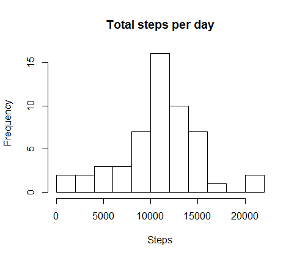
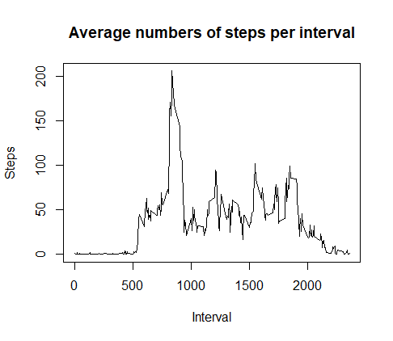
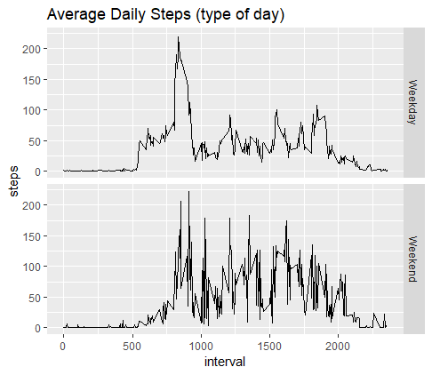

## Code for reading in the dataset and/or processing the data

Get the data

```{r,echo=TRUE}

name <- "repdata_data_activity"

if (!file.exists(name)){
        fileURL <- "https://d396qusza40orc.cloudfront.net/repdata%2Fdata%2Factivity.zip"
        download.file(url = fileURL,destfile = name,method = "curl")
}

if (!file.exists("activity.csv")){
        unzip(name)
}

data <- read.csv(file = "activity.csv")
```


##  Histogram of the total number of steps taken each day

Calculate total spets per day

```{r,echo=TRUE,message=FALSE}
library(dplyr)
total_steps_per_day <- aggregate(steps~date,data = data,FUN = sum, na.rm=T)
```

Make histogram 

```{r,echo=TRUE}
hist(total_steps_per_day$steps,main = "Total steps per day",xlab = "Steps", breaks = 10)
```
<!-- -->


## Mean and median number of steps taken each day

mean

```{r,echo=TRUE}
mean_number <- round(mean(total_steps_per_day$steps, na.rm = T))
mean_number
```
```
## [1] 10766
```
median
```{r,echo=TRUE}
median_number <- median(total_steps_per_day$steps, na.rm = T)
median_number
```
```
## [1] 10765
```
## 4Time series plot of the average number of steps taken

Average steps by interval
```{r,echo=TRUE}
average_steps <- aggregate(steps~interval,data = data,FUN = mean,na.rm=T)

plot(x =average_steps$interval,y = average_steps$steps,type = "l", main = "Average numbers of steps per interval",
     ylab = "Steps",xlab = "Interval")
```

<!-- -->

## The 5-minute interval that, on average, contains the maximum number of steps
```{r,echo=TRUE}
max_steps <- average_steps$interval[which.max(average_steps$steps)]
max_steps
```
```
## [1] 835
```

## Code to describe and show a strategy for imputing missing data
```{r,echo=TRUE}
missed_value <- sum(is.na(data$steps))
missed_value
```
```
## [1] 2304
```
```
data2 <- data
na <- is.na(data2$steps)
average_for_interval <- tapply(data2$steps,data2$interval,FUN = mean, na.rm=T)
data2$steps[na] <- average_for_interval[as.character(data2$interval)[na]]
sum(is.na(data2$steps))
```
```
## [1] 0
```

## Histogram of the total number of steps taken each day after missing values are imputed
```{r,echo=TRUE}
total_steps_per_day_after <- summarise(group_by(data2,date),steps=sum(steps))

hist(total_steps_per_day_after$steps,main="Total steps per day after 
     missing values are imputed",
     xlab = 'Steps',breaks = 10)
```

<!-- -->

Panel plot comparing the average number of steps taken per 5-minute interval across weekdays and weekends
```{r,echo=TRUE}
data2$date <- as.Date(data2$date)
data2$d <- weekdays(data2$date)
data2$day <- ifelse(data2$d == c("суббота","воскресенье"), "Weekend" ,"Weekday")
data2$d <- NULL


aver_per_weekend_weekday <- summarise(group_by(data2,interval,day),steps=mean(steps))


library(ggplot2)

ggplot(data = aver_per_weekend_weekday,mapping = aes(x = interval,y = steps))+
        geom_line()+
        facet_grid(day~.)+
        labs(title = "Average Daily Steps (type of day)")
```
<!-- -->

